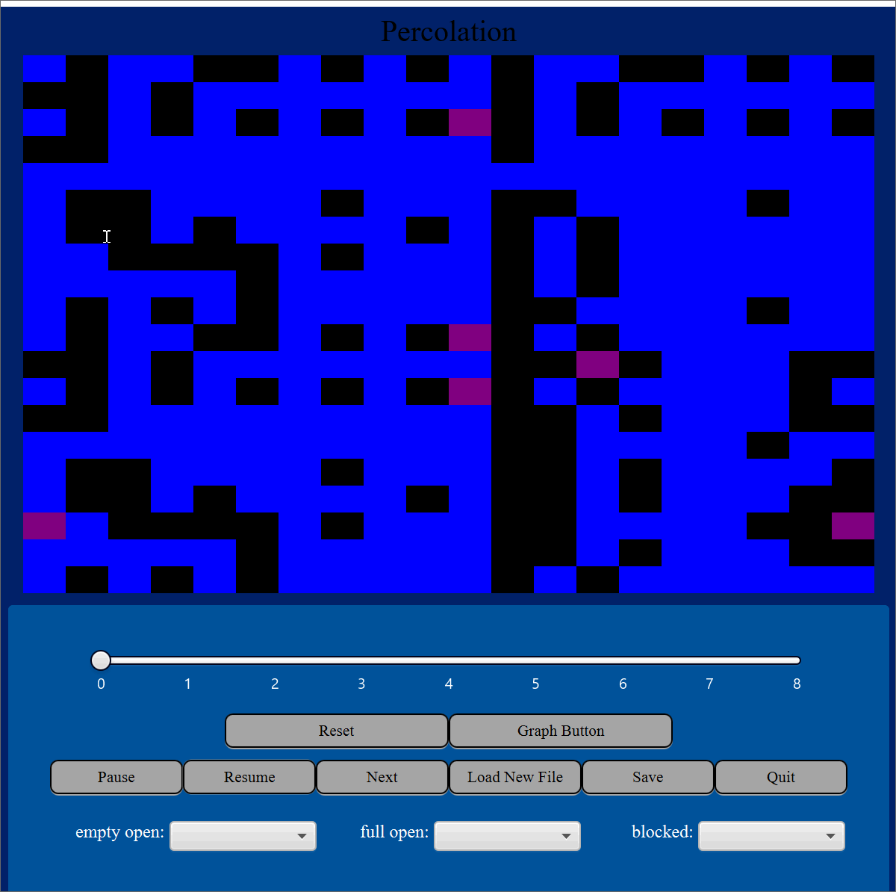

Simulation
====

This project implements a cellular automata simulator.

### Resources Used

Professor Duvall's lectures and notes from class
- Examples of reflection
- Examples of abstraction
- Principles such as Open Closed, Single Responsibility, Liskov's Substitution
StackOverFlow
Rules for CA simulations:
- Schelling's Model of Segregation: https://www2.cs.duke.edu/courses/fall20/compsci307d/assign/03_simulation/nifty/mccown-schelling-model-segregation
- Wa-Tor World model of predator-prey relationships: https://www2.cs.duke.edu/courses/fall20/compsci307d/assign/03_simulation/nifty/scott-wator-world
- Spreading of Fire: https://www2.cs.duke.edu/courses/fall20/compsci307d/assign/03_simulation/nifty/shiflet-fire
- Rock, Paper, Scissors: https://softologyblog.wordpress.com/2018/03/23/rock-paper-scissors-cellular-automata/
- Conway's Game of Life: http://web.stanford.edu/class/archive/cs/cs106b/cs106b.1132/handouts/07-Assignment-1-Life.pdf
- Percolation: https://docs.google.com/document/d/1F-pxg7BixEUDnjVUNiRBY0mcE-_RTzbBpToPNx6IOvg/edit

### Running the Program

Main class:

**Start**: Contains the method to <code>launch args</code> and run the program.

Data files needed: 

All the data csv files are located in the data folder. The properties files are located in the resources directory in src, and the properties files for the languages are located in the languageresources directory. The css files are located in the styleresources directory.

Note: For the tests, some of the files needed to run the tests are in the <code>Test Sources</code> folder. This folder needs to be set as the Test Resources root.

Features implemented:

### Simulations

**Schelling's model of segregation**: The American economist Thomas Schelling created an agent-based model that might help explain why segregation is difficult to combat. His model of segregation showed that even when individuals did not mind being surrounded by people of a different race, they would still choose to segregate themselves from others over time. Although the model is quite simple, it gives a look at how individuals might self-segregate, even when they have no explicit desire to do so.

**Wa-Tor World model of predator-prey relationships**: 	This model carries out the simulation proposed by A.K. Dewdney is his article Sharks and Fish Wage an Ecological War on the Toroidal Planet Wa-Tor, Scientific America Computer Recreations column. Wa-Tor World a biological simulation of two species with various parameters such as time between breeding and time before starving.

**Spreading of Fire**: If a small area of a forest catches fire, then that fire spreads to a neighboring cell with some probability determined by factors such as wind, precipitation falling, or dryness of the leaves and timber.  We model transition rules by a function spread.  At each simulation iteration, we apply spread to each cell site to determine its value — EMPTY, TREE, or BURNING — at the next time step. 

**Rock Paper Scissors**: Every pixel color is calculated by playing a virtual 9 player game of rock paper scissors. The current cell vs its immediate 8 neighbors. If the neighbor count is greater than a threshold value in the result that beats the current cell then the current cell becomes the winner. Can effectively model competing bacteria colonies.

**Game of Life**: Conway's Game of Life models populations using the following rules. 
Any live cell with two or three live neighbours survives. 
Any dead cell with three live neighbours becomes a live cell. 
All other live cells die in the next generation. Similarly, all other dead cells stay dead. 

**Percolation**:  Each site is either open or blocked. A full site is an open site that can be connected to an open site in the top row via a chain of neighboring (left, right, up, down) open sites. In diagrams we color full sites blue to model water flowing from the top through the system. We say the system percolates if there is at least one full site in the bottom row.

#### Segregation

Red: RACE 1 
Blue: RACE 2 
White: NO RACE

#### Predator Prey

Turquoise:SPECIES 1 (Ex. FISH) 
Blue: SPECIES 2 (Ex. SHARK) 
Black: WATER

#### Spreading of Fire

Green: TREE 
Yellow: EMPTY cell of land 
Red: BURNING cell

#### Rock, Paper, Scissors

Red: ROCK 
Blue: PAPER 
Green: SCISSORS

#### Game of Life

Red: ALIVE cell 
Black: DEAD cell

#### Percolation

Blue: OPEN FULL 
Purple: OPEN NOT FULL 
Black: BLOCKED

- Different edge policies: These include Finite, Klein Bottle, and Torodial.

#### Klein Bottle

Notice how the enclosed block on the bottom right and top left side of the screen are full because the grid connects on both sides after twisting one of the sides. Site: https://en.wikipedia.org/wiki/Klein_bottle.

#### Torodial

Notice how the enclosed block on the right and left side of the screen are full because the grid connects on both sides.

- Different neighborhood policies: These include Complete, Diagonal, and Cardinal.

#### Diagonal

Only the northeast, southeast, northwest, and southwest neighbors count. The cells blocked above and below remain blocked.

#### Cardinal

Only the north, east, south, and west count as neighbors. The cells that are blocked diagonally remain blocked.

- **Three languages: English, Spanish, and French.**

Below is the panel you can choose a language and shape from.

- **Simulation graph: Represents the number of each type of state in the simulation across time.**

- **Ability to load new files, pause, reset, change speed, and step through simulation.**

As shown in the above gifs, the user can press the buttons in order to change the simulation. To increase the speed, drag the slider to the right.

- **Different shapes in grid: Triangle, Hexagon, and Rectangle.**

#### Triangle

#### Hexagon

**- Style of Cells: Both images and different colors can be loaded onto the cells.**

**- Different Themes: A few different colors / themes can be loaded upon startup into the simulation.**

Different themes can be chosen. Look at the Duke and UNC below!

**- Exception handling.**

An error box opens up upon a user entering an invalid simulation or any other error.

### Notes/Assumptions

Different styles
- Different colors for the cells
- Different languages can be chosen upon startup
- Different images
- Grids are outlined for the simulations with a large number of cells for easier identification.

User Interactive Mode
- Ability to dynamically change the speed of the simulation through an interactive slider.

Different Shapes
- Triangle Grid
- Hexagon Grid
- Rectangle Grid
